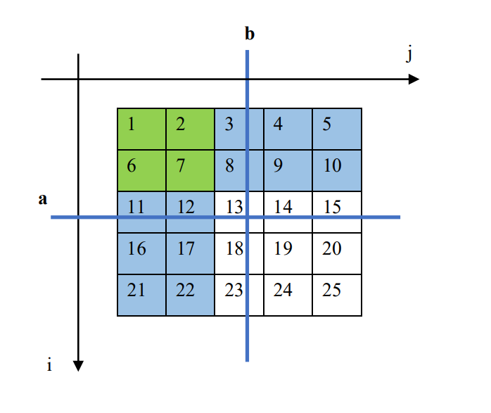
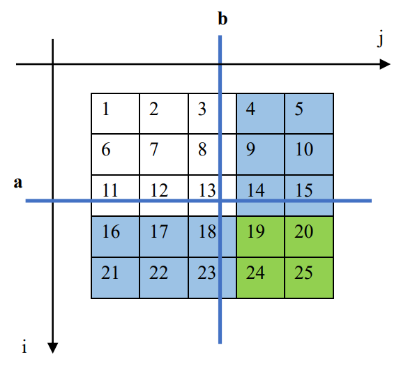

# 茴香豆的四种写法

## 直接搜索

使用二重循环直接遍历矩阵中的每个值，时间复杂度为$O(NM)$，代码略。

## 对其中一个维度使用二分优化

注意到这里的矩阵具有一定的有序性，**有序**容易让我们联想到二分。对于寻找有序数组中的值的问题，是二分的典型应用场景，不过在本题中，处理的对象不是有序数组，而是一个有序的矩阵，并且这个矩阵的**有序性**比较奇特。不过退化到一维情况，我们不难看出：**矩阵在单独的行或者单独的列上都是有序的**。这时候一个最简单的想法就呼之欲出：先循环遍历其中一个维度，再对另一个维度使用二分。

```py
class Solution:
    def findNumberIn2DArray(self, matrix: list[list[int]], target: int) -> bool:
        if len(matrix) == 0 or len(matrix[0]) == 0:
            return False
        for row in matrix:
            if row[0] <= target <= row[-1]:
                left = 0
                right = len(row)
                while left < right:
                    mid = (left + right) // 2
                    if row[mid] == target:
                        return True
                    elif row[mid] > target:
                        right = mid
                    else:
                        left = mid + 1
        return False
```

使用$O(N)$的遍历和$O(\log M)$的二分，总时间复杂度是$O(N\log M)$，对于绝大多数场景这已经足够好了。

## 优雅的做法：四分

上面说到“对于寻找有序数组中的值的问题，是二分的典型应用场景”，我们知道数组不过可以看作一维的矩阵，那么对于二维的矩阵，是否有对应的推广形式的方法呢？

答案是有的。

二分的本质是对于问题区间折半划分，然后找到对应的子区间，在子区间上递归地进行以上过程。那么对于矩阵形式，问题则是如何找到对应的子矩阵，然后递归地执行以上过程就可以了。

考虑当前点的坐标为$(a, b)$，那么由题意可知，所有值小于$\text{matrix}[a][b]$的点其坐标满足条件：

$$ \{(i, j) | i < a\} \cup \{(i, j) | j < b\}$$

我们画个图，可以清楚的看到这个集合可以这样地划分为子矩阵：



其中绿色是两个集合的交集部分，只用取一次。所有的蓝色+绿色的区域为下一个子矩阵，只要有其中一个子矩阵中存在解即可满足条件，所以分别在三个子矩阵上递归执行搜索，并将结果取或。

形如

```py
def f(matrix):
    ...
    if ...
        return f(sub1) or f(sub2) or f(sub3)
    ...
```

对于所有值大于$\text{matrix}[a][b]$的点同理，如图：



```py
class Solution:
    def findNumberIn2DArray(self, matrix: list[list[int]], target: int) -> bool:
        if len(matrix) == 0 or len(matrix[0]) == 0:
            return False

        def quad_search(
                row_lo: int, row_hi: int, column_lo: int, column_hi: int, target: int
        ):
            if row_lo < row_hi and column_lo < column_hi:
                row_mid = (row_lo + row_hi) // 2
                column_mid = (column_lo + column_hi) // 2
                if matrix[row_mid][column_mid] == target:
                    return True
                elif matrix[row_mid][column_mid] > target:
                    return quad_search(row_lo, row_mid, column_lo, column_mid, target) or \
                           quad_search(row_lo, row_mid, column_mid, column_hi, target) or \
                           quad_search(row_mid, row_hi, column_lo, column_mid, target)
                else:
                    return quad_search(row_mid + 1, row_hi, column_mid + 1, column_hi, target) or \
                           quad_search(row_lo, row_mid + 1, column_mid + 1, column_hi, target) or \
                           quad_search(row_mid + 1, row_hi, column_lo, column_mid + 1, target)
            else:
                return False

        return quad_search(0, len(matrix), 0, len(matrix[0]), target)
```

时间复杂度为$O(\log (NM))$。不过由于用了递归，所以会有栈空间开销。

## 巧妙的做法：单调性搜索

时间复杂度为$O(N + M)$，略，见题解。


